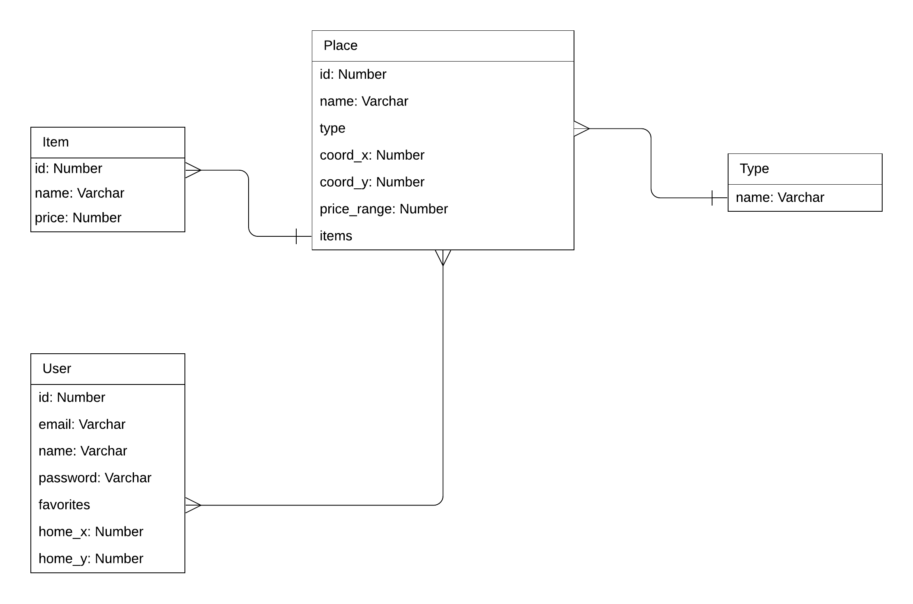

### Overview
We will start off with a very simple design.  
One table for the places and one for the users.  
The types will translate to `enum`s in the code.  
For a start we will store the items for each place.  
This means that every item that is sold in a particular place will be stored in our database.
This might be changed later.  
To keep this consistent with the actual data we will have to develop a daemon service
that keeps fetching data and updating/inserting to the database.  

The design will most likely extended later on and every iteration will be pushed to this document.

### Database type
We will stick to PostgreSQL for now and use `R2DBC`for now which is a driver 
for reactie Spring.

More info about R2DBC here:  
[Video 1](https://www.youtube.com/watch?v=kKyiLcFFe2E)  
[Video 2](https://www.youtube.com/watch?v=xQEJFUPeQ_8)  

### Design iteration 1
