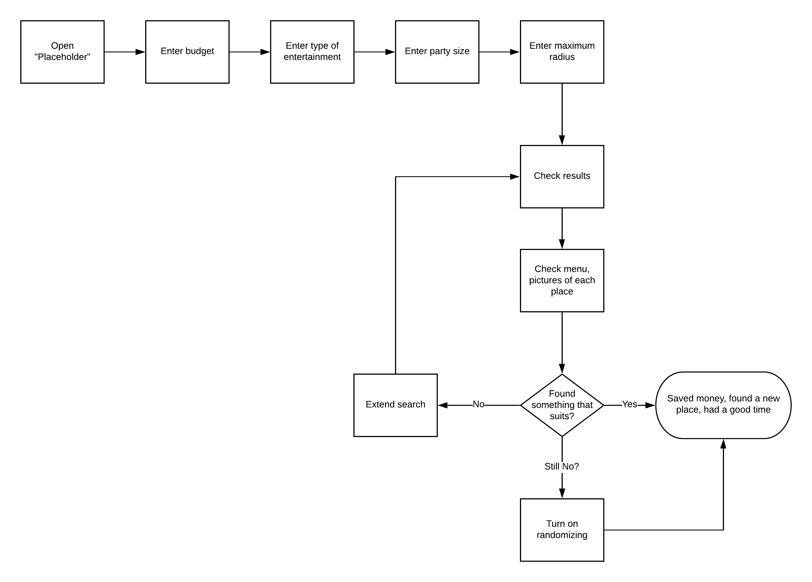

## Basic technical details
### Back-end
1. Spring back-end with Java 13 for start
2. Using reactive Spring, not MVC
3. PostgreSQL DB

Google Maps API will be queried via REST calls and the data we receive will probably be cached in
our DB.  

### Front-end
It's not trivial to have one code-base for both Desktop/Android/IOS so this is still
an on-going discussion.  
Probably React native will be the choice.  
Platform to upload data for owners.

### Database Model
TBD

## Flowchart

## Design Plan
1. Design database model (including indexing etc.)
2. Design communication model
3. Segregate responsibilities if possible to multiple services
4. Some small mock-up for the UI
5. Have a complete documentation ready with charts
6. Create feature tickets (epics possibly) from the design plan

## Development Plan
1. Set up CI working with PR and master
2. Wire up Github with CI
3. Set up Sonar
4. Set up coverage tool
5. Set up Google Maps API
6. Have a basic parsing for the JSON they return
7. Store something in the DB
8. Have a basic UI 
9. Wire up the UI with the back-end
10. Create the uploading logic on the back-end
11. Create an uploading platform on the UI
12. Try to create an algorithm for finding the menu, image parsing
13. Have a look at some artificial intelligence, image recognition
14. Improve the algorithm
15. Improve performance

## Acceptance criteria for 0.1
Ideally we want something that works on the mentioned platforms.  
We should have an upload page, and a map to check the nearby places.  
The map should include some basic info, pictures and some prices. 
